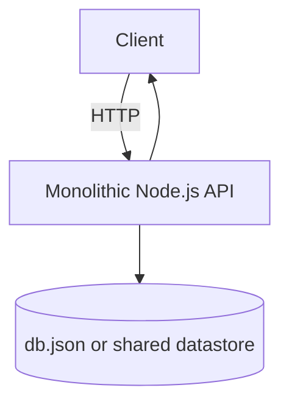
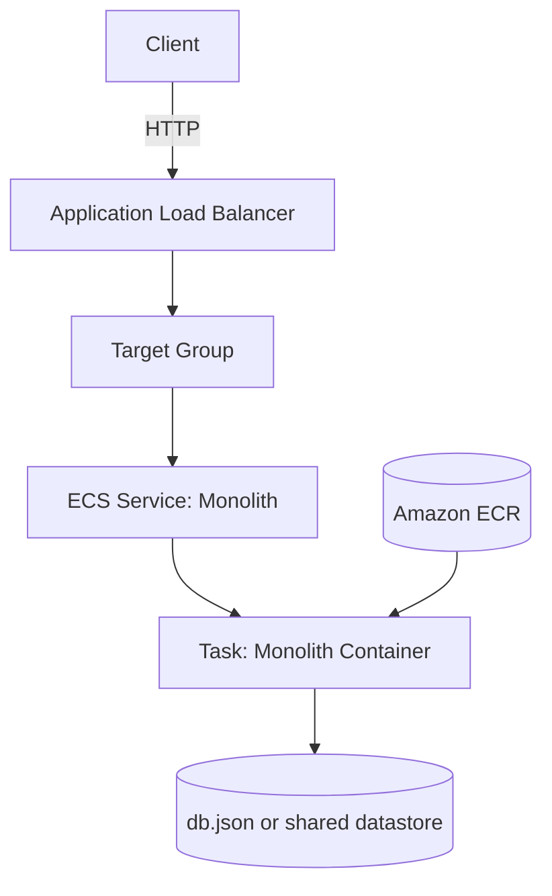
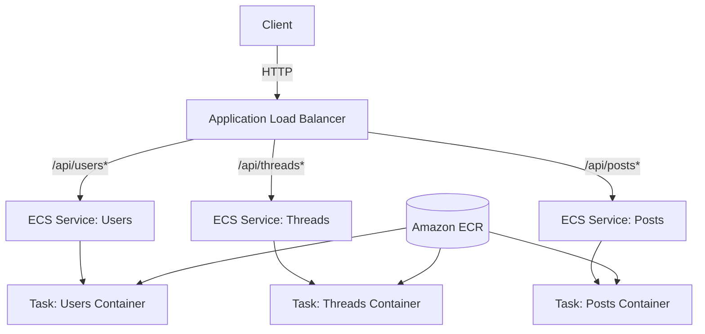
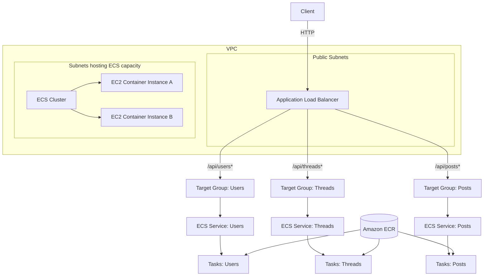
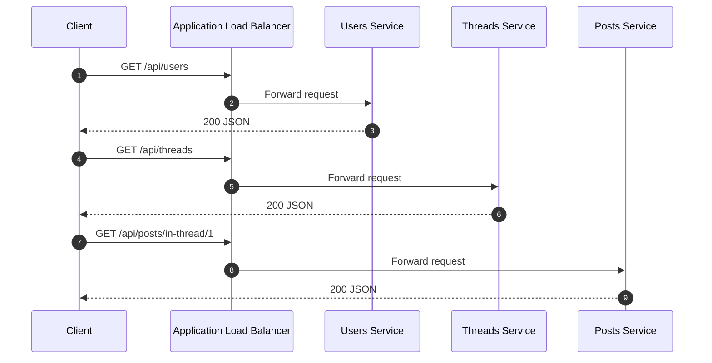

# Breaking a Monolithic Node.js Application into Microservices (AWS ECS)

This project demonstrates how a traditional monolithic Node.js application can be evolved into a scalable microservices architecture using containerization and AWS-managed infrastructure. The example workload is a message board API where users can view users, create and view discussion threads, and post messages within threads.

## Table of Contents

- [Project Overview](#project-overview)
- [Architecture Evolution](#architecture-evolution)
  - [1) Monolithic Architecture](#1-monolithic-architecture)
  - [2) Containerized Monolith](#2-containerized-monolith)
  - [3) Microservices Architecture](#3-microservices-architecture)
- [Final Architecture (ECS + ALB Path Routing)](#final-architecture-ecs--alb-path-routing)
- [Request Flow](#request-flow)
- [Microservices and API Paths](#microservices-and-api-paths)
- [Project Structure](#project-structure)
- [Implementation Steps](#implementation-steps)
  - [Step 1 — Run the Monolithic Application](#step-1--run-the-monolithic-application)
  - [Step 2 — Containerize the Monolith](#step-2--containerize-the-monolith)
  - [Step 3 — Push Image(s) to Amazon ECR](#step-3--push-images-to-amazon-ecr)
  - [Step 4 — Deploy Containerized Monolith to ECS](#step-4--deploy-containerized-monolith-to-ecs)
  - [Step 5 — Refactor into Microservices](#step-5--refactor-into-microservices)
  - [Step 6 — Deploy Microservices (3 ECS Services)](#step-6--deploy-microservices-3-ecs-services)
- [Example API Endpoints](#example-api-endpoints)
- [Screenshots for Portfolio](#screenshots-for-portfolio)
- [Key Skills Demonstrated](#key-skills-demonstrated)
- [Production-Grade Improvements](#production-grade-improvements)
- [Technologies Used](#technologies-used)
- [Conclusion](#conclusion)

## Project Overview

The system starts as a single Node.js service (monolith). It is then:

- Containerized with Docker
- Pushed to Amazon Elastic Container Registry (ECR)
- Deployed to Amazon Elastic Container Service (ECS) on EC2 container instances
- Refactored into three independent microservices
- Deployed behind an Application Load Balancer (ALB) using path-based routing

Core user capabilities:

- View users
- Create and view discussion threads
- Post messages within threads

## Architecture Evolution

### 1) Monolithic Architecture

All functionality is implemented and deployed as one Node.js service.

Characteristics:

- One codebase
- One deployment unit
- One server handles all API routes
- Scaling scales the entire application

Challenges:

- Hard to scale specific features independently
- Tight coupling between different domains
- Maintenance complexity grows quickly as features increase



### 2) Containerized Monolith

The monolithic service is packaged as a Docker image and deployed on ECS, improving portability and deployment consistency.

Benefits introduced:

- Consistent runtime environment
- Portable deployment artifact (container image)
- ECS orchestration and controlled scaling (still as a single service)



### 3) Microservices Architecture

The monolith is split into multiple services, each owning one business capability. Each service runs in its own container and is deployed as its own ECS service.

Benefits:

- Each service can scale independently
- Deployments are smaller and safer (reduced blast radius)
- Teams can work more independently on separate domains



## Final Architecture (ECS + ALB Path Routing)

Launch type: ECS on EC2 container instances.

AWS components:

- Amazon ECS Cluster (EC2 launch type)
- EC2 container instances (cluster capacity)
- Amazon ECR repositories (image storage)
- Application Load Balancer (request routing)
- Target Groups (one per service)
- Listener rules (path-based routing)



## Request Flow

Path-based routing: one ALB listener routes to different target groups based on request path patterns.



## Microservices and API Paths

| Service         | API Paths        | Responsibility              |
| --------------- | ---------------- | --------------------------- |
| Users Service   | `/api/users/*`   | Manage users                |
| Threads Service | `/api/threads/*` | Manage discussion threads   |
| Posts Service   | `/api/posts/*`   | Manage posts within threads |

ALB routing rules:

| Path pattern    | Target                       |
| --------------- | ---------------------------- |
| `/api/users*`   | Users Service target group   |
| `/api/threads*` | Threads Service target group |
| `/api/posts*`   | Posts Service target group   |

## Project Structure

```text
project/
├── 1-no-container
│   ├── server.js
│   ├── index.js
│   ├── db.json
│   └── package.json
│
├── 2-containerized-monolith
│   ├── server.js
│   ├── Dockerfile
│   ├── db.json
│   └── package.json
│
└── 3-containerized-microservices
    ├── users
    │   ├── server.js
    │   ├── Dockerfile
    │   └── package.json
    │
    ├── threads
    │   ├── server.js
    │   ├── Dockerfile
    │   └── package.json
    │
    └── posts
        ├── server.js
        ├── Dockerfile
        └── package.json
```

## Implementation Steps

### Step 1 — Run the Monolithic Application

Install dependencies:

```bash
npm install koa
npm install koa-router
```

Start the app:

```bash
npm start
```

Test endpoints:

```bash
curl localhost:3000/api/users
curl localhost:3000/api/threads
curl localhost:3000/api/posts/in-thread/1
```

### Step 2 — Containerize the Monolith

Example Dockerfile:

```dockerfile
FROM node:alpine

WORKDIR /srv

COPY . .

RUN npm install

EXPOSE 3000

CMD ["node","server.js"]
```

Build the image:

```bash
docker build -t mb-repo .
```

### Step 3 — Push Image(s) to Amazon ECR

Create an ECR repository:

```text
mb-repo
```

Authenticate Docker to ECR:

```bash
aws ecr get-login-password | docker login ...
```

Tag the image:

```bash
docker tag mb-repo:latest <ECR-URI>:latest
```

Push the image:

```bash
docker push <ECR-URI>:latest
```

### Step 4 — Deploy Containerized Monolith to ECS

Infrastructure created:

- ECS Cluster
- EC2 container instances
- Task definition
- ECS service
- Application Load Balancer
- Target group

The ECS service maintains the desired number of running tasks across cluster nodes.

### Step 5 — Refactor into Microservices

Split the monolithic API into three services:

- Users Service
- Threads Service
- Posts Service

Each service has:

- Its own `server.js`
- Its own `Dockerfile`
- Its own `package.json`
- Its own ECR repository and ECS service

### Step 6 — Deploy Microservices (3 ECS Services)

Create three ECR repositories:

- `mb-users-repo`
- `mb-threads-repo`
- `mb-posts-repo`

For each service:

- Build Docker image
- Push to ECR
- Create ECS task definition
- Create ECS service
- Register tasks into its target group

ALB listener rules route traffic based on path patterns:

| Path Pattern    | Target Service  |
| --------------- | --------------- |
| `/api/users*`   | Users Service   |
| `/api/posts*`   | Posts Service   |
| `/api/threads*` | Threads Service |

Default rule: handle invalid/unmatched requests.

## Example API Endpoints

Users:

- `/api/users`
- `/api/users/2`

Threads:

- `/api/threads`

Posts:

- `/api/posts/in-thread/2`

## Screenshots for Portfolio

Capture screenshots of:

- ECS cluster overview
- ECS services list (users/threads/posts)
- Task definition revisions
- ECR repositories and image tags
- Load balancer listeners and rules
- Target groups health status
- API responses in browser or curl output

## Key Skills Demonstrated

- Microservices architecture design
- Docker containerization
- AWS ECS (EC2 launch type) service deployment
- Amazon ECR image publishing
- Application Load Balancer path-based routing
- REST API design with Node.js + Koa

## Production-Grade Improvements

This demo uses simplified components for learning. A production-ready version typically includes:

- Amazon RDS or DynamoDB (instead of JSON file storage)
- Centralized logging (CloudWatch Logs) and tracing
- CI/CD pipeline (GitHub Actions / CodePipeline)
- Auto Scaling policies and capacity providers
- Authentication and authorization
- Rate limiting and request validation
- Service discovery or an API Gateway (depending on constraints)

## Technologies Used

- Node.js
- Koa.js
- Docker
- AWS ECS
- Amazon ECR
- Application Load Balancer
- EC2

## Conclusion

By evolving from a monolith to independently deployable microservices on AWS ECS, the system becomes easier to scale, more resilient to change, and simpler to maintain as features and traffic grow.
